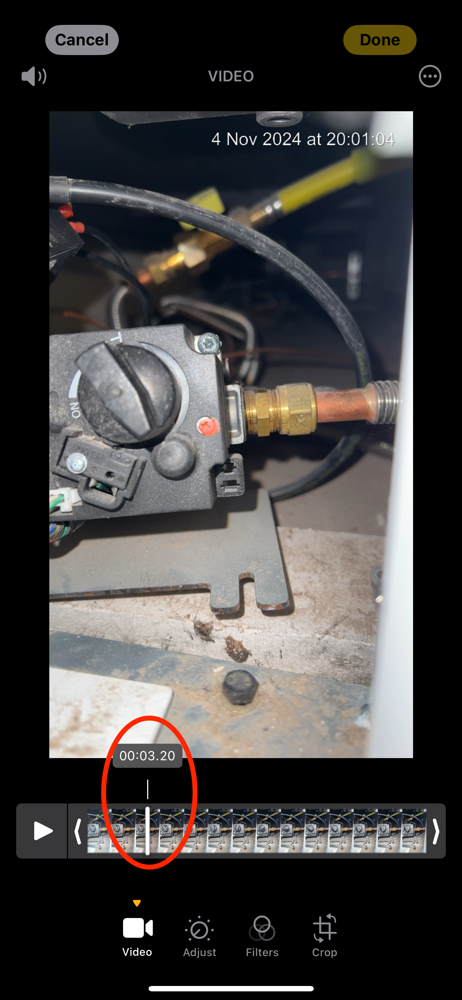
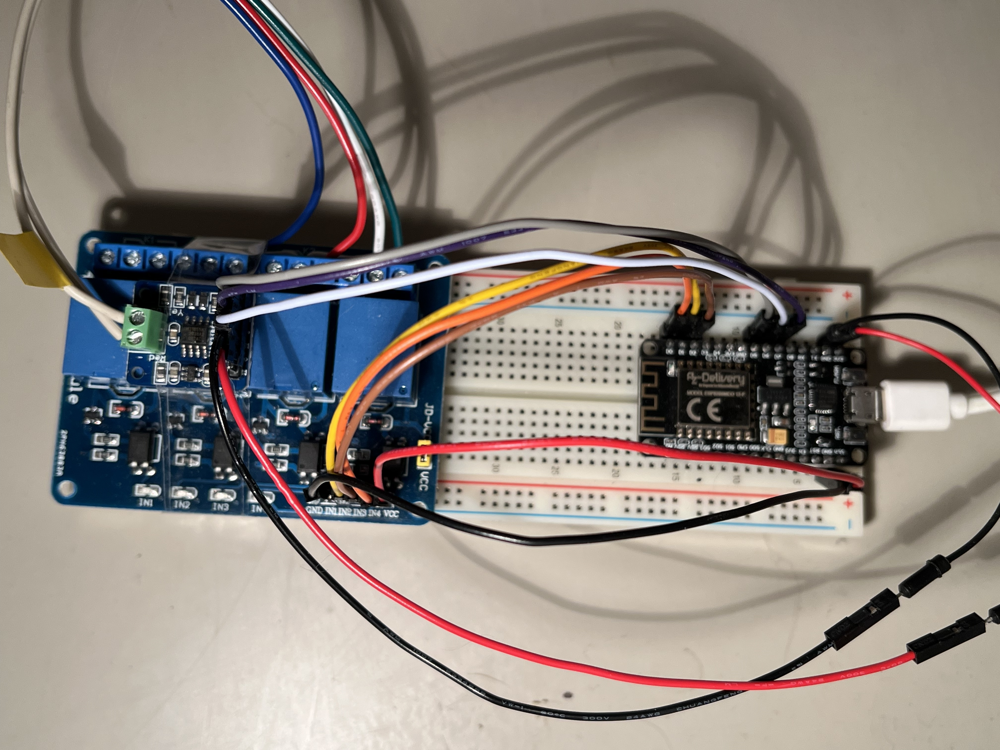
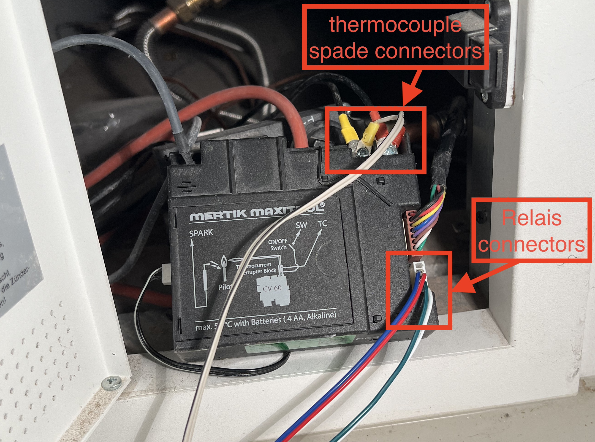
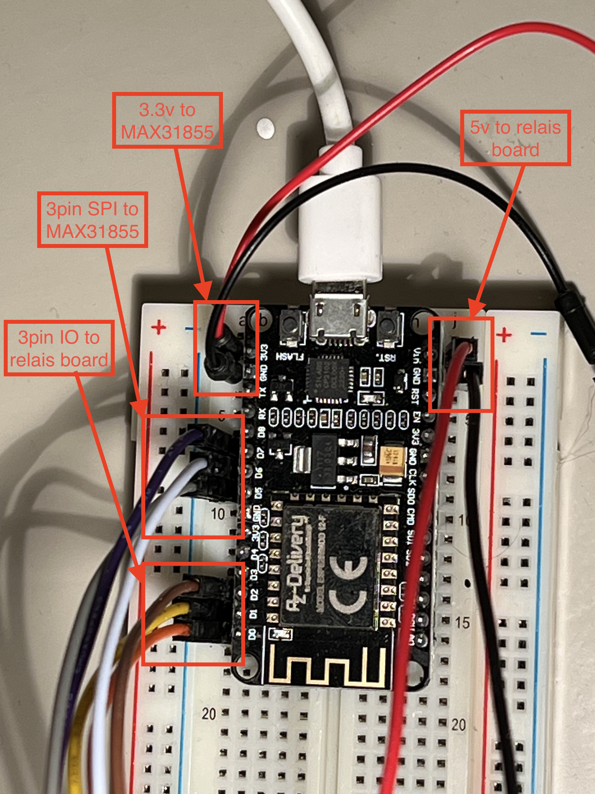
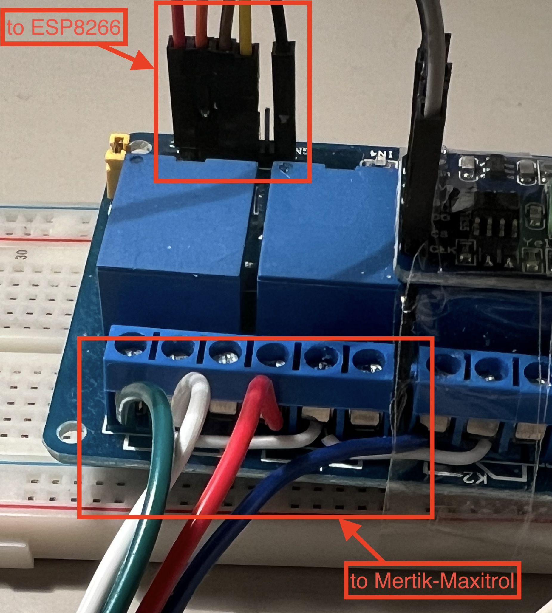
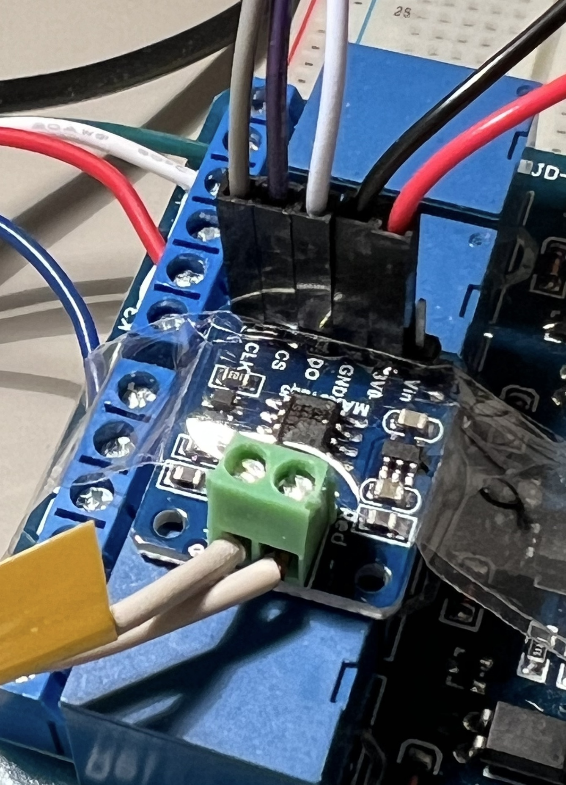

# homie-mertik-maxitrol

Homie interface to a Mertik Maxitrol controlled fireplace using an ESP8266 device.

What makes this implementation special is that it can actually read the current
state of the pilot, using a thermocouple. Where most implementations only focus
on sending commands to the device.

The [Homie convention](https://homieiot.github.io/) is an MQTT based convention
that describes devices. So to use this repository, you need an MQTT server.
Ideally also a Homie controller, but directly using the MQTT topics will work
equally well.

## How it works

The Mertik-Maxitrol controller has an external interface to send commands to.
Check the PDF files in the Github repo for details. The commands are:

- **start**: start/ignite the pilot flame
- **higher**: open the valve further
- **lower**: close the valve further
- **stop**: stop/extinguish the pilot flame

The device does not offer a way to retrieve the current state. To circumvent some of this
we use a MAX31855 thermocouple reader board. By connecting it to the thermocouple wiring
we can read a temperature. From my testing it is not accurate (in the on state it reported only 50 Celsius, which seemed low), but good enough to distinguish between being on or off.

Controlling the valve (and hence flame height) is done based on timing. This does however
mean that if someone uses the wallpanel, or remote control, it will go out of sync.

## Homie Device

If you don't know what Homie is, then [read up on it](https://homieiot.github.io/), since it offers a nice way to abstract your home automation away from any single implementation (if you ever switched from one to another, like Home Assistant, OpenHAB, Domoticz, Homey, Fibaro, Zipato, then you know what I'm talking about).

The device has an ID specified in the header file. Here I'll assume the default
value `fireplace`.

**Important**: the `pilot` and `burner` nodes are independent. The burner level can be
changed while the fireplace is off. After turning it on, it will move to the setting
as specified by `burner`. Setting a new `burner` value will not automatically turn on
the fireplace.

The description of the Homie device, in `nodes` and their `properties`:

### Node: *pilot*

#### Property: *value*

This property controls the pilot flame.

- type: bool
- settable: true
- retained: true
- format: "off,on"

topic | description
-|-
`homie/5/fireplace/pilot/value`|current value of the pilot flame
`homie/5/fireplace/pilot/value/$target`|intended new state (device is working to get there)
`homie/5/fireplace/pilot/value/set`|here you can set `true` or `false` to change the state

#### Property: *status*

This property provides extra user feedback on what the device is doing, since igniting
and extinguishing the pilot take quite some time.

- type: enum
- settable: false
- retained: true
- format: "off,igniting,on,extinguishing"

topic | description
-|-
`homie/5/fireplace/pilot/status`|current status of the pilot flame, any of the labels from the "format"

### Node: *burner*

#### Property: *level*

- type: float
- format: "0:100:1"
- settable: true
- retained: false
- unit: %

topic | description
-|-
`homie/5/fireplace/burner/value`|current value of the burner in %
`homie/5/fireplace/burner/value/$target`|intended new level in %
`homie/5/fireplace/burner/value/set`|here you can set level in %

## Getting started

### Software

copy [`homie-mertik-maxitrol.h.template`](homie-mertik-maxitrol.h.template) to
`homie-mertik-maxitrol.h` and modify it with the appropiate values for the secrets
and other configuration.

Making those items configurable without modifying source code is on the TODO list.

The software can be uploaded to the ESP using the Arduino IDE.

## Calibrating

Since the positioning is based on timing the movements, it might be necessary to
calibrate the exact timings.

The timings are set in milliseconds.

setting | default | description
-|-|-
`POSITION_RANGE_MAX` | `9000` | time from fully closed to fully open
`POSITION_USER_MIN` | `4000` | time from fully closed, where flames start to appear, so the lowest possible setting WITH flames showing
`POSITION_USER_MAX` | `9000` | time after which flames will not go any higher.

Setting the `burner` to 0% will fully close the valve. At 1% it will go to the
"user-minimum", so the lowest flames possible. Anything else will be mapped
between user-min and user-max. Here's a diagram to explain:

```
closed                               open
0             4000                   9000 RANGE_MAX
+-------------+-------------------------+
              | USER_MIN                | USER_MAX
              |                         |
0%            1% -->    mapped    <-- 100%
```

The best way I found to find `POSITION_RANGE_MAX` was to record a video using my iPhone.
Once done, edit the video, and slide through it using the control at the bottom. It will
show very precise timing to find when the valve started moving and when it stopped at its
end position. See image:



### Hardware

The components:

* **ESP8266**, I used an "AZ-Delivery NodeMCU LUA Amica V2", with a "ESP8266MOD 12-F" CPU
* **Relay board**, with 3 relays minimum. Connected to 3 IO pins on the ESP module
* **MAX31855 thermocouple reader** (Adafruit), with software SPI. Connected to 3 pins on the ESP module.
* 4 wire connector cable to the Mertik-Maxitrol connector (made my own)
* 2 wire thermocouple cable with Y-shape spade connectors (made my own)

Additional:
* A box
* power supply + cable

See the pictures on how to wire up the device.

### Overview:

A breadboard with the ESP module on the right, on the left the relais board, and on top of the relais board (with some sticky tape to keep it in place) the MAX31855 breakout board.



---

The wiring to the Mertik Maxitrol controller. The yellow and red connectors
of the thermocouple. And the 4 wires for the command interface to the relais board.



---

The wiring up to the ESP module:
* 3.3v to the MAX31855 thermocouple board
* 3 pins for the SPI interface to the thermocouple
* 5v (from the USB connector) to the relais board
* 3 pins to control the 3 relais



---

The relais module takes the 'common' (white wire in this case)) from the Mertik Maxitrol connector and loops it to each of the 3 relais. Each of the relais is then connected by the output to the corresponding pin on the Mertik Maxitrol connector.



---

The final piece is the MAX31855 thermocouple board. At the top the incoming 3.3v power and 3 SPI pins. At the bottom the thermocouple coming from the Mertik Maxitrol.


